# FrameShift

<p align="center">
  Windows-first offline media processing built for fast right-click workflows.
</p>

<p align="center">
  FFmpeg and FFprobe powered. Local only. Lightweight WinForms UI. Clean output handling.
</p>

<p align="center">
  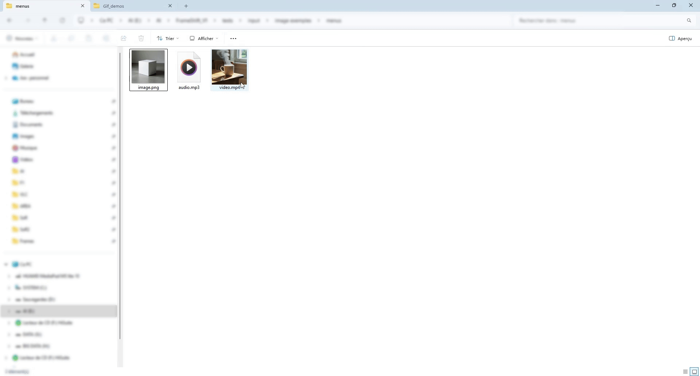
</p>

## Overview

FrameShift is a desktop utility for fast video, audio, image, and AI-assisted media tasks on Windows.  
Its main goal is simple: let you launch useful actions directly from Explorer context menus, make the right adjustments quickly, and save the result next to the source file with safe unique naming.

Remove backgrounds locally with a focused AI workflow directly launched from Explorer.

<p align="center">
  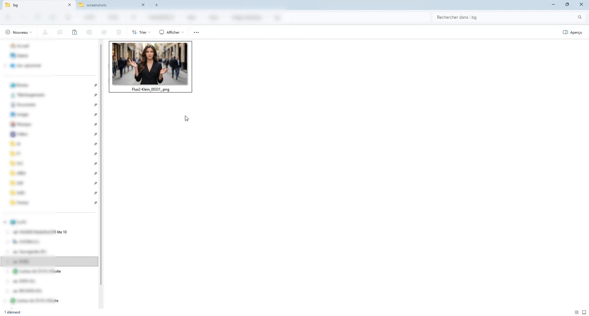
</p>

Build image-based PDF documents with a visual layout workflow designed for quick adjustments.

<p align="center">
  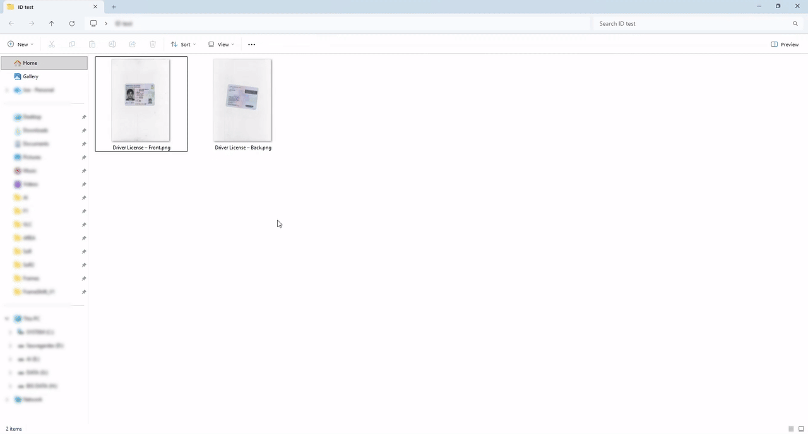
</p>

## Why FrameShift

- Right-click driven workflow for everyday media tasks
- Offline processing with local tools only
- No overwrite behavior, outputs stay next to source files
- FFmpeg and FFprobe at the core
- Focused WinForms interface built for speed and clarity
- Clean cancellation and practical batch-friendly flows

## Quick Workflow

1. Right-click a file in Explorer.
2. Choose a FrameShift action from the context menu.
3. Adjust only the settings you need.
4. Start processing and get a clean output beside the original file.

## Actions

### Video Actions

| Action | Short Description | Screenshot |
| --- | --- | --- |
| Convert Video | Convert video files to common formats with a fast, focused workflow. | 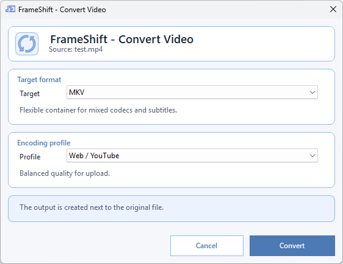 |
| Remove Audio | Create a silent video version without changing the basic workflow. |  |
| Extract Frames | Export video frames as image sequences for review, editing, or assets. | 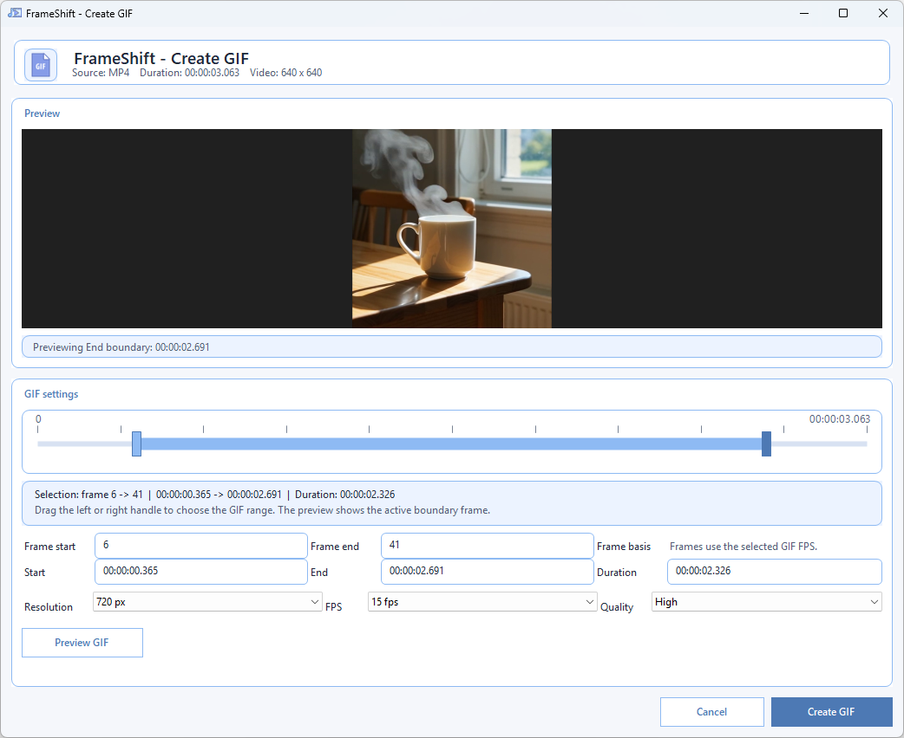 |
| Create GIF | Turn a video segment into a GIF with preview-oriented controls. |  |
| Extract Audio | Pull the audio track from a video into a standalone file. | 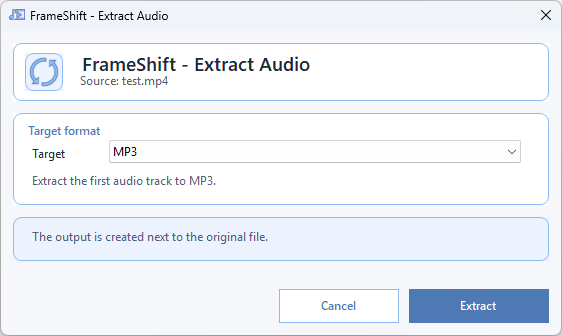 |
| Cut Video | Trim a video to the exact segment you want. | 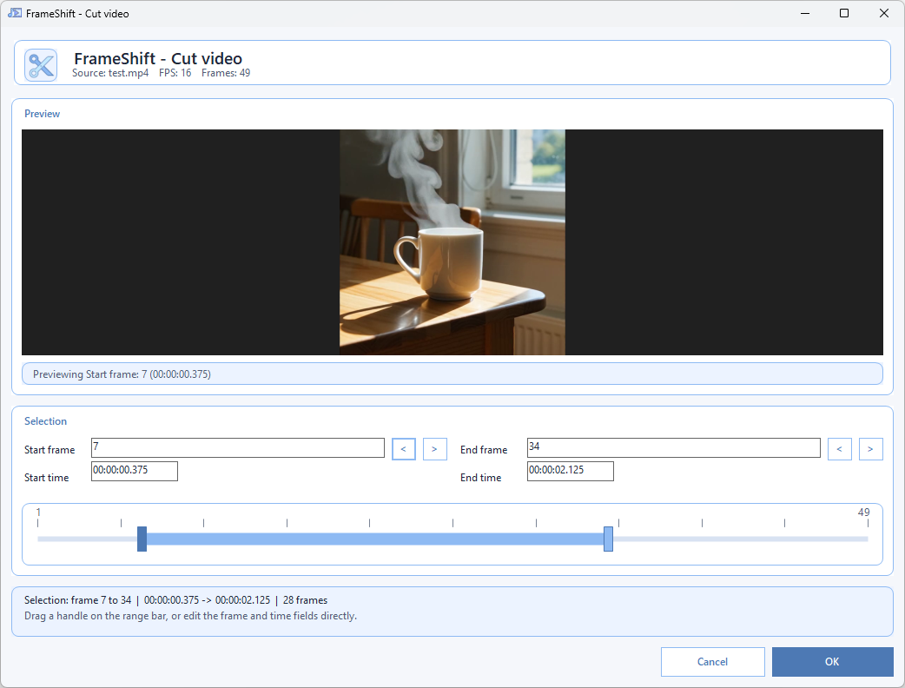 |
| Crop Video | Remove unwanted borders or focus on a specific video area. | 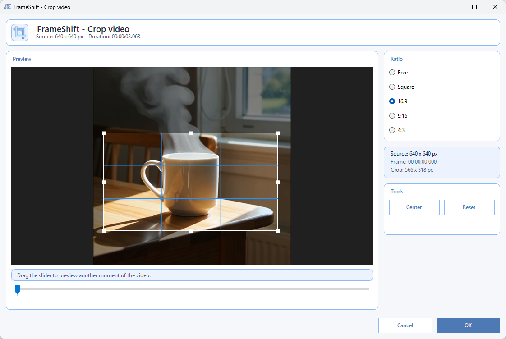 |
| Rotate / Flip Video | Fix orientation issues or mirror video content quickly. | 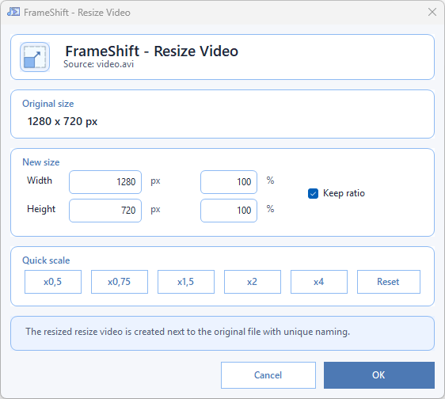 |
| Resize Video | Change video dimensions for sharing, compatibility, or lighter exports. |  |
| Compress Video | Reduce file size with practical quality-oriented presets. | 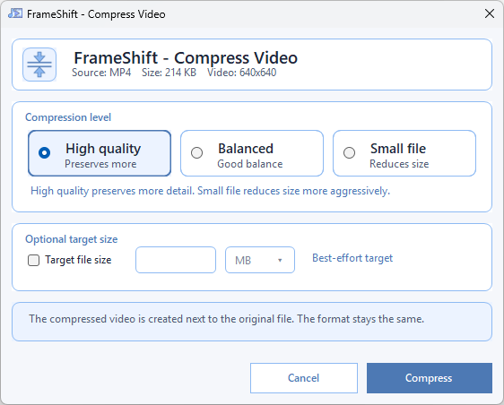 |
| Change Video Speed | Speed up or slow down a video with a simple adjustment flow. | 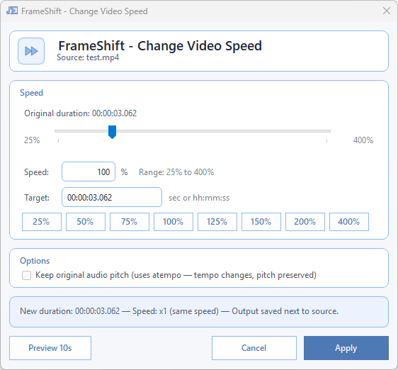 |
| Interpolate Video | Generate smoother motion and higher frame-rate playback. | 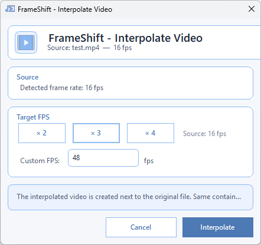 |
| Media Info | Inspect technical media details directly from the FrameShift workflow. | 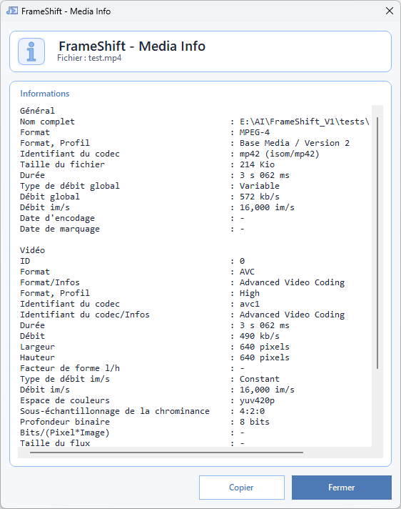 |

### Audio Actions

| Action | Short Description | Screenshot |
| --- | --- | --- |
| Convert Audio | Convert audio files to other formats with a clean minimal flow. | 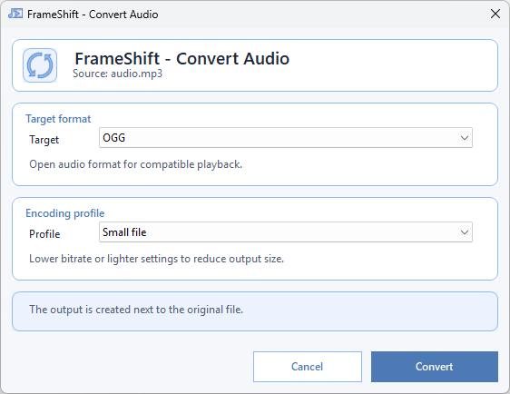 |
| Cut Audio | Trim audio precisely without leaving the right-click workflow. | 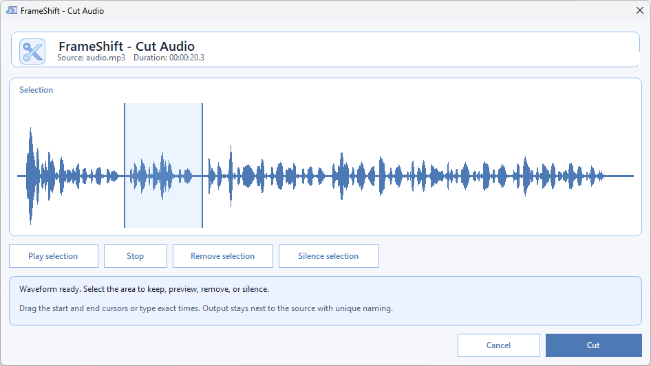 |
| Reverse Audio | Reverse an audio file for sound design or quick experiments. |  |
| Compress Audio | Reduce audio size for easier sharing and storage. | 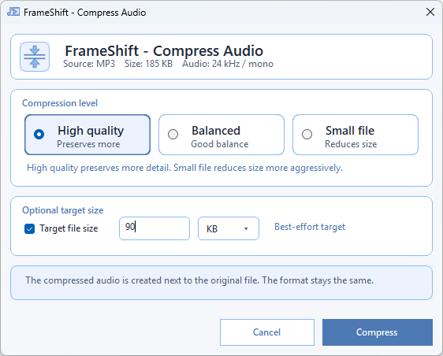 |
| Change Pitch | Shift audio pitch with a straightforward adjustment interface. | 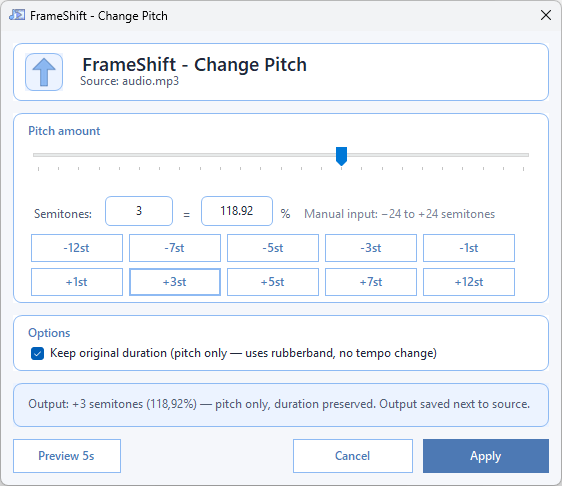 |
| Change Audio Speed | Speed up or slow down audio while keeping the workflow simple. | 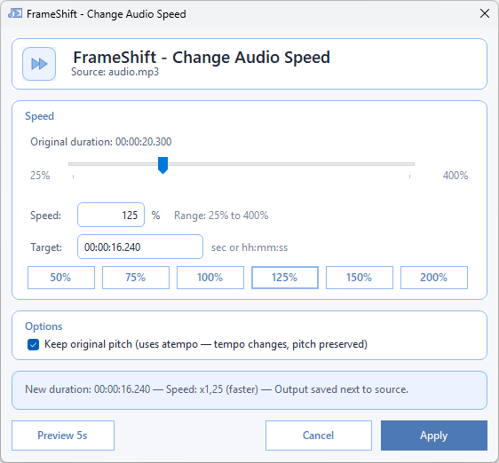 |

### Image Actions

| Action | Short Description | Screenshot |
| --- | --- | --- |
| Convert Image | Convert images between practical everyday formats. |  |
| Compress Image | Reduce image size while keeping the process quick and readable. | 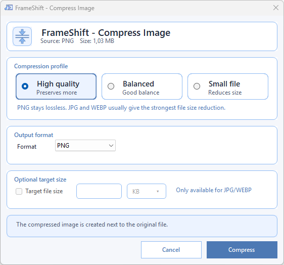 |
| Convert to Icon | Build `.ico` files from images with multi-size export support. | 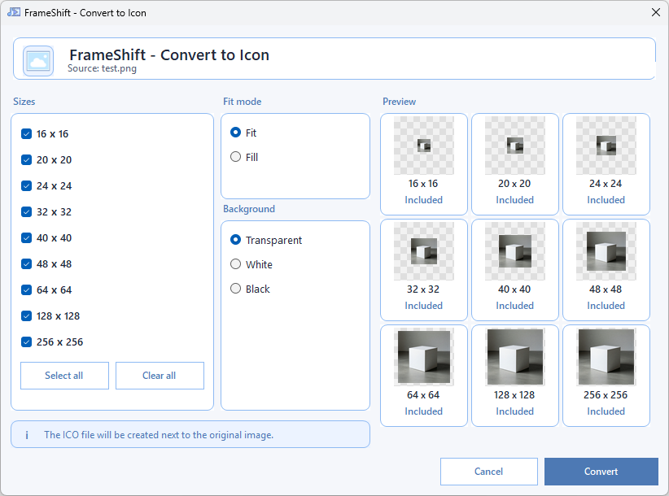 |
| Crop Image | Crop images visually with direct manipulation controls. | 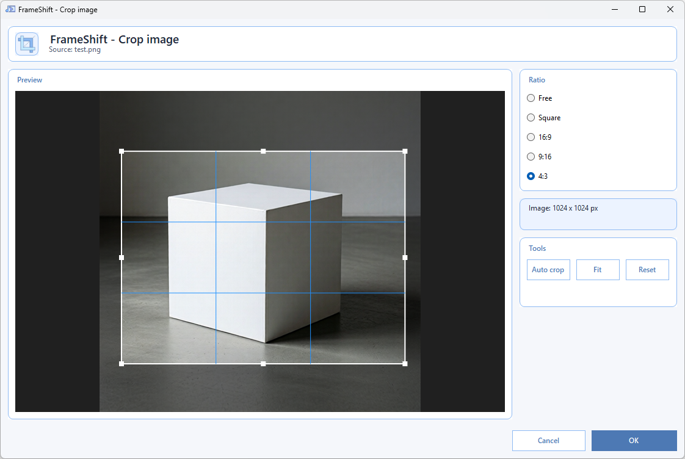 |
| Resize Image | Resize images for web, sharing, or asset preparation. | 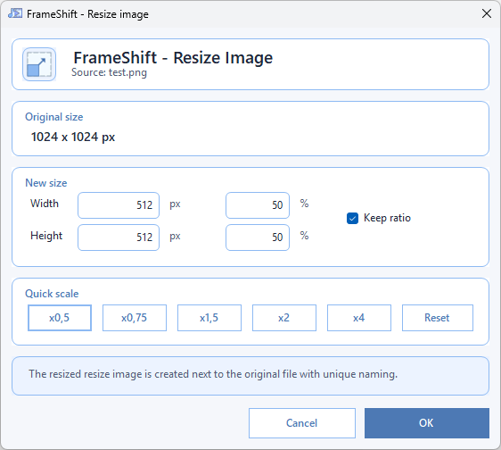 |
| Rotate / Flip Image | Correct image orientation or mirror an image in a few clicks. | 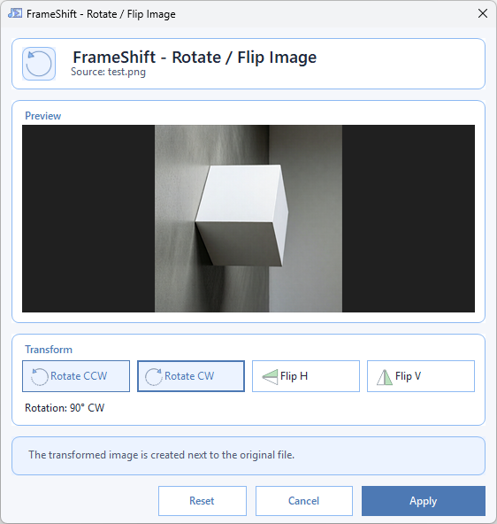 |
| Image to PDF | Assemble one or more images into a PDF document. | 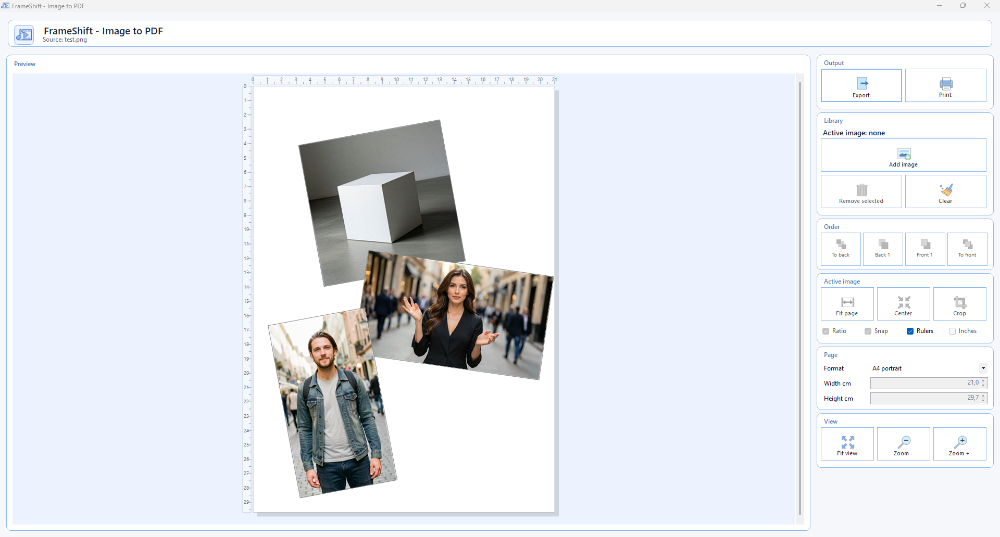 |

### AI Actions

| Action | Short Description | Screenshot |
| --- | --- | --- |
| Remove Background | Remove the background from an image with the local AI workflow. |  |
| Audio Separation | Split audio into vocals, drums, bass, other, and instrumental with the local AI workflow. | 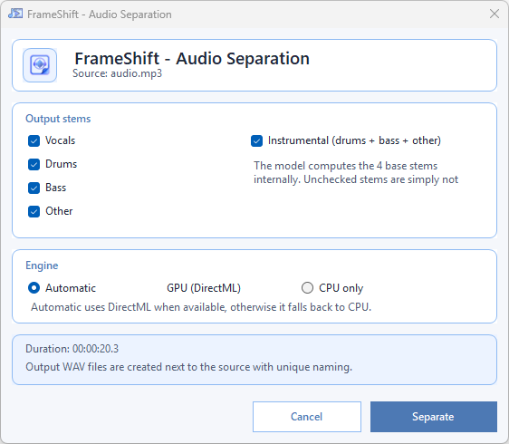 |

## Built For

- Fast everyday media conversions
- Creator and editor utility workflows
- Clean Windows Explorer integration
- Offline processing environments
- Users who want practical tools instead of heavy software

## Technology

- C#
- .NET 8 LTS
- WinForms
- FFmpeg
- FFprobe
- Optional local AI components with ONNX Runtime DirectML

## Project Structure

```text
src/FrameShift/
installer/
docs/
tests/
```

## Documentation

- [Documentation Index](docs/README.md)
- [Project Overview](docs/PRODUCT_GUIDE.md)
- [Project Rules](docs/PROJECT_RULES.md)
- [Architecture Freeze](docs/ARCHITECTURE_FREEZE.md)
- [Migration Plan](docs/MIGRATION_PLAN.md)
- [Changelog](docs/CHANGELOG.md)
- [Code File Index](docs/CODE_FILE_INDEX.md)

## Notes

- FrameShift is distributed under the GNU GPL v3.0. See [LICENSE](LICENSE).
- Third-party components and optional AI model notices are listed in [THIRD_PARTY_NOTICES.md](THIRD_PARTY_NOTICES.md).
- `references/` is reference-only.
- Active runtime resources must stay inside the real FrameShift project tree.
- Before rebuilding the installer, publish the app so the setup packs the latest release payload.

```powershell
.\build_installer.ps1
```
