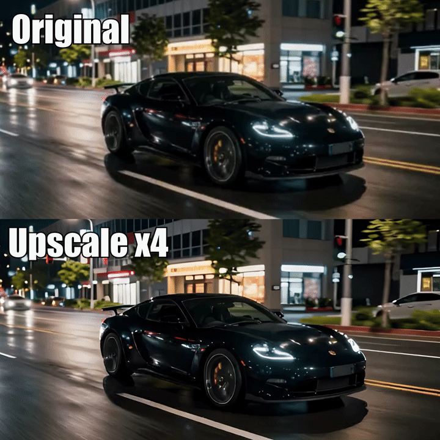
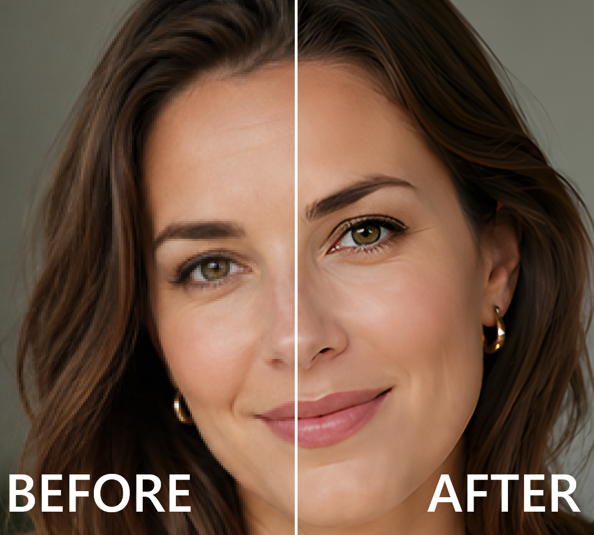
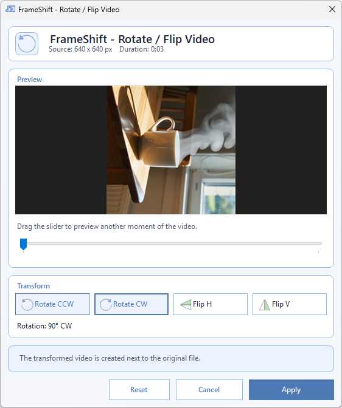
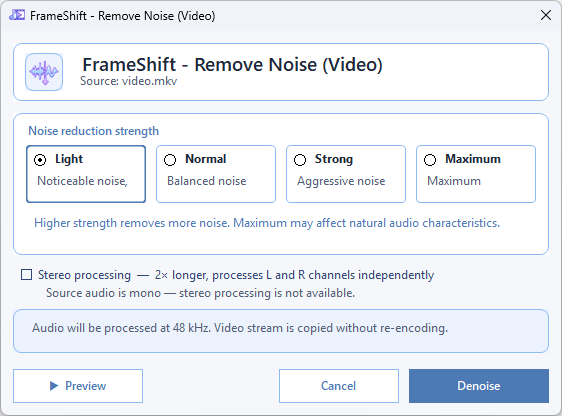
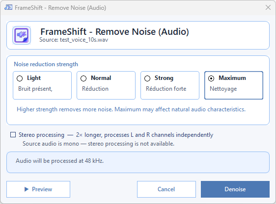
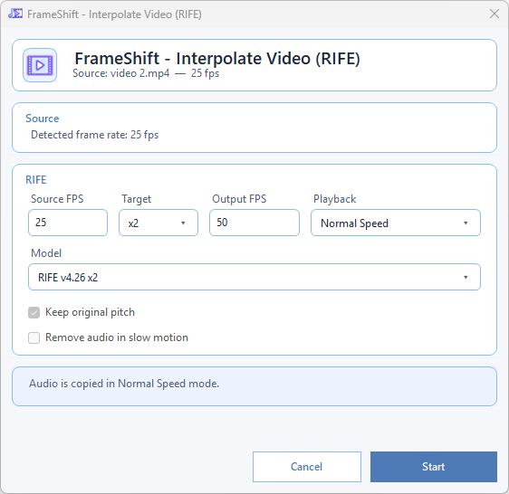
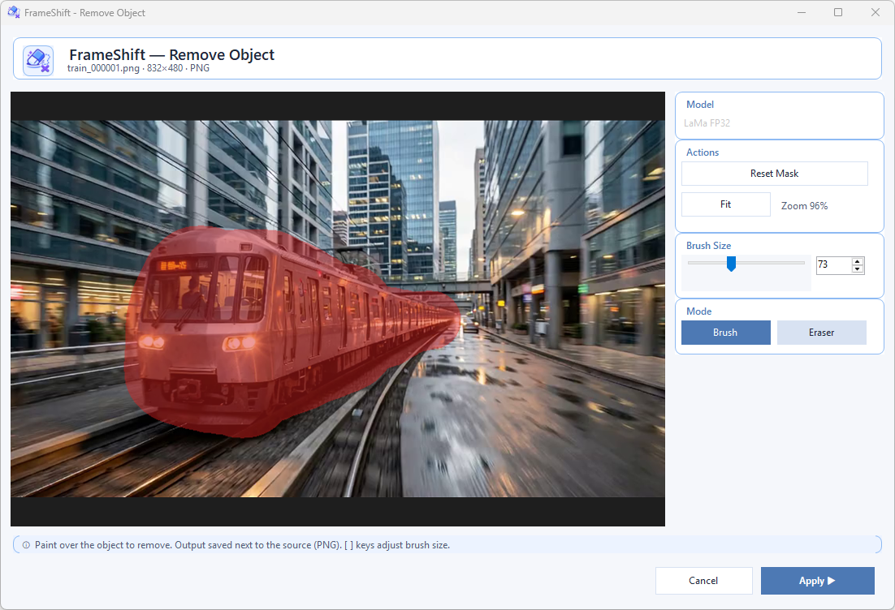

# FrameShift

<p align="center">
  <strong>Free, open-source FFmpeg GUI for Windows — local media utility with Explorer right-click integration and local AI.</strong>
</p>

<p align="center">
  <a href="https://gaurox.dev/frameshift/"></a>
  <a href="https://github.com/gaurox/FrameShift/releases"></a>
  <a href="LICENSE"></a>
  
  
</p>

<p align="center">
  
</p>

---

## Table of Contents

- [Download](#download)
- [Overview](#overview)
- [Why FrameShift](#why-frameshift)
- [Quick Workflow](#quick-workflow)
- [Actions](#actions)
- [Technology](#technology)
- [Documentation](#documentation)

---

## Download

**[→ Download latest release (.exe installer)](https://github.com/gaurox/FrameShift/releases/latest)**

Current version: **1.14.0** · Windows 10 / 11 · self-contained · no extra install required.

Versioning uses `1.<feature release>.<patch>`: feature releases start at `.0`; small fixes increment
the final number (`1.14.1`, `1.14.2`, etc.).

---

## Overview

FrameShift is a desktop utility for fast video, audio, image, and AI-assisted media tasks on Windows.  
Its main goal is simple: let you launch useful actions directly from Explorer context menus, make the right adjustments quickly, and save the result next to the source file with safe unique naming.

Remove backgrounds, remove objects from images, upscale images and videos, remove noise, and separate audio locally with focused AI workflows launched directly from Explorer.
RIFE interpolation is also available as a dedicated local AI workflow for smoother motion on supported video clips.

<p align="center">
  
</p>

Upscale videos locally with Real-ESRGAN General v3, AnimeVideo v3, or x4plus Quality. FrameShift keeps
the source frame rate and audio, supports ×2 / ×3 / ×4 and custom sizes, and uses DirectML with CPU
and encoder fallbacks. Image and video upscale models remain isolated in their own verified folders.

<p align="center">
  
</p>

Upscale images with a local AI model picked from a simple dropdown: Real-ESRGAN x4plus for general photos, screenshots and AI images, Real-ESRGAN Anime 6B for illustrations and line art, and Swin2SR for restoration-grade quality. Choose ×2, ×3, ×4 or a custom target size (aspect-locked). It runs on the GPU via DirectML with CPU fallback, tiles large images automatically, and saves the result next to the source.

<p align="center">
  
</p>

Build image-based PDF documents with a visual layout workflow designed for quick adjustments.

<p align="center">
  
</p>

Crop images and videos with a dedicated visual editor that now supports automatic border detection, mouse-wheel zoom, and drag navigation for tighter framing with less manual work.

## Why FrameShift

- Right-click driven workflow for everyday media tasks
- Offline processing with local tools only
- No overwrite behavior, outputs stay next to source files
- FFmpeg and FFprobe at the core
- Focused WinForms interface built for speed and clarity
- Clean cancellation and practical batch-friendly flows

## Quick Workflow

1. Right-click a file in Explorer.
2. Choose a FrameShift action from the context menu.
3. Adjust only the settings you need.
4. Start processing and get a clean output beside the original file.

## Actions

### Video Actions

| Action | Short Description | Screenshot |
| --- | --- | --- |
| Convert Video | Convert video files to common formats with a fast, focused workflow. |  |
| Remove Audio | Create a silent video version without changing the basic workflow. |  |
| Extract Frames | Export video frames as image sequences for review, editing, or assets. |  |
| Create GIF | Turn a video segment into a GIF with preview-oriented controls. |  |
| Extract Audio | Pull the audio track from a video into a standalone file. |  |
| Cut Video | Trim a video to the exact segment you want. |  |
| Crop Video | Remove unwanted borders or focus on a specific video area with visual controls, frame-based auto crop, zoom, and drag navigation. |  |
| Rotate / Flip Video | Fix orientation issues or mirror video content quickly. |  |
| Resize Video | Change video dimensions for sharing, compatibility, or lighter exports. |  |
| Compress Video | Reduce file size with practical quality-oriented presets. |  |
| Change Video Speed | Speed up or slow down a video with a simple adjustment flow. |  |
| Interpolate Video | Generate smoother motion and higher frame-rate playback. |  |
| Remove Noise (Video) | Remove background noise from a video's audio track without re-encoding the video. |  |
| Media Info | Inspect technical media details directly from the FrameShift workflow. |  |

### Audio Actions

| Action | Short Description | Screenshot |
| --- | --- | --- |
| Convert Audio | Convert audio files to other formats with a clean minimal flow. |  |
| Cut Audio | Trim audio precisely without leaving the right-click workflow. |  |
| Reverse Audio | Reverse an audio file for sound design or quick experiments. | |
| Compress Audio | Reduce audio size for easier sharing and storage. |  |
| Change Pitch | Shift audio pitch with a straightforward adjustment interface. |  |
| Change Audio Speed | Speed up or slow down audio while keeping the workflow simple. |  |
| Remove Noise (Audio) | Reduce background noise in audio with the local DeepFilterNet3 workflow. |  |

### Image Actions

| Action | Short Description | Screenshot |
| --- | --- | --- |
| Convert Image | Convert images between practical everyday formats. |  |
| Compress Image | Reduce image size while keeping the process quick and readable. |  |
| Convert to Icon | Build `.ico` files from images with multi-size export support. |  |
| Crop Image | Crop images visually with direct manipulation controls, auto crop, mouse-wheel zoom, and drag navigation. |  |
| Resize Image | Resize images for web, sharing, or asset preparation. |  |
| Rotate / Flip Image | Correct image orientation or mirror an image in a few clicks. |  |
| Image to PDF | Assemble one or more images into a PDF document. |  |

### AI Actions

| Action | Short Description | Screenshot |
| --- | --- | --- |
| Remove Background | Remove the background from an image with local AI modes: Fast, High Resolution Matting (CPU), High Resolution General (CPU), plus two optional **user-supplied** BRIA RMBG-2.0 modes (Balanced / High Quality). The BRIA models are never bundled, downloaded or redistributed by FrameShift — you obtain them manually from BRIA's [official page](https://huggingface.co/briaai/RMBG-2.0/tree/main) (non-commercial / CC BY-NC 4.0) and place them in the model folder. Re-launches while the progress window is already open are appended directly to the visible queue, including repeated runs on the same source file. |  |
| Remove Noise (Audio) | Strip background noise from audio files with strength control, stereo mode, and live preview. |  |
| Remove Noise (Video) | Denoise a video's audio track without re-encoding the video stream. |  |
| Audio Separation | Split audio into vocals, drums, bass, other, and instrumental with the local AI workflow. |  |
| Interpolate Video (RIFE) | Generate smoother motion with the local RIFE workflow, model preflight, and adjacent unique outputs. |  |
| Remove Object (Image) | Paint a mask over any object and let the local inpainting AI reconstruct the background. Two models available: LaMa FP32 (Quality) and LaMa 2025 (Fast). |  |
| Upscale Image | Enlarge an image with a local AI model, chosen from a dropdown picker: **Real-ESRGAN x4plus** (general, default), **Real-ESRGAN Anime 6B** (anime / illustration), and **Swin2SR** (restoration / quality). Pick **×2 / ×3 / ×4** or a **custom target size** (aspect-locked width/height). Runs on GPU via DirectML with CPU fallback, automatic invisible tiling for large images, and the result saved as a new PNG next to the source. Models are downloaded on demand and integrity-checked. |  |
| Upscale Video | Enlarge a video **×2 / ×3 / ×4** (or to an aspect-locked target size) with **Real-ESRGAN General v3**, **AnimeVideo v3**, or x4plus Quality. Uses DirectML with CPU fallback and shared adaptive tiling; preserves FPS and audio, with safe encoding fallbacks, batch progress, cancellation, and adjacent unique output. Image and video models use separate hosted/local folders, each with dedicated documentation and licences; downloads are SHA256-verified. |  |

## Built For

- Fast everyday media conversions
- Creator and editor utility workflows
- Clean Windows Explorer integration
- Offline processing environments
- Users who want practical tools instead of heavy software

## Technology

- C#
- .NET 8 LTS
- WinForms
- FFmpeg
- FFprobe
- Optional local AI components with ONNX Runtime DirectML

## Project Structure

```text
src/FrameShift/
installer/
docs/
tests/
```

## Documentation

- [Documentation Index](docs/README.md)
- [Project Overview](docs/PRODUCT_GUIDE.md)
- [Project Rules](docs/PROJECT_RULES.md)
- [Architecture Freeze](docs/ARCHITECTURE_FREEZE.md)
- [Migration Plan](docs/MIGRATION_PLAN.md)
- [Changelog](docs/CHANGELOG.md)
- [Release Checklist and Versioning](docs/RELEASE_CHECKLIST.md)
- [Code File Index](docs/CODE_FILE_INDEX.md)
- [RIFE Interpolation Notes](docs/RIFE_INTERPOLATION_NOTES.md)
- [Upscale Video Implementation](docs/UPSCALE_VIDEO_PLAN.md)
- [Third-Party Model Licences](THIRD_PARTY_NOTICES.md)

## FAQ

**Is FrameShift free?**  
Yes. Completely free, no subscription, no trial period.

**Is it open source?**  
Yes. GNU GPL v3.0. Source code is available in this repository.

**Does it send my files anywhere?**  
No. All processing happens locally on your machine. No upload, no cloud, no telemetry.

**Does it require FFmpeg to be installed separately?**  
No. FFmpeg and FFprobe are bundled — nothing to install manually.

**Does it work without an internet connection?**  
Yes. FrameShift is fully offline. An internet connection is only used the first time you download an optional AI model.

**What Windows versions are supported?**  
Windows 10 and Windows 11 (x64).

**Is it a replacement for HandBrake or Shutter Encoder?**  
It is an alternative for quick, everyday media tasks from the Windows right-click menu. HandBrake and Shutter Encoder are more complete converters; FrameShift is faster to reach (no app to open) and adds local AI features like background removal, upscaling, stem separation and denoising.

---

## Notes

- FrameShift is distributed under the GNU GPL v3.0. See [LICENSE](LICENSE).
- Third-party components and optional AI model notices are listed in [THIRD_PARTY_NOTICES.md](THIRD_PARTY_NOTICES.md).
- `references/` is reference-only.
- Active runtime resources must stay inside the real FrameShift project tree.
- Before rebuilding the installer, publish the app so the setup packs the latest release payload.

```powershell
.\build_installer.ps1
```

---

## Related / Keywords

FFmpeg GUI · FFmpeg frontend · FFmpeg interface · free video converter Windows · batch media converter · Windows right-click media tools · HandBrake alternative · Shutter Encoder alternative · Format Factory alternative · local AI media tools · remove background offline Windows · RIFE GUI · RIFE interpolation Windows · Demucs GUI · audio stem splitter free · DeepFilterNet GUI · noise removal audio Windows · image upscaler Windows · Real-ESRGAN GUI · LaMa inpainting Windows · offline AI tools Windows · privacy-friendly media converter
